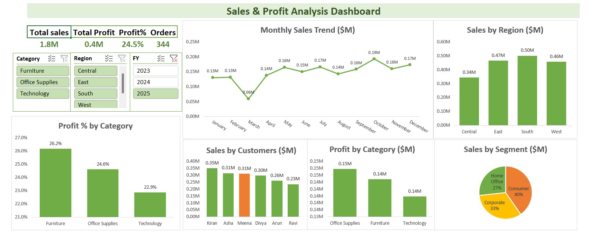

# 📊 Sales & Profit Analysis Dashboard (Excel)
Sales & Profit Analysis Dashboard using Excel, Power Query and Power Pivot
 
## 🔍 Overview
This project analyzes sales data and presents insights using an interactive Excel dashboard.

## ⚙️ Tools Used
- Microsoft Excel  
- Power Query  
- Power Pivot (DAX)  

## 📈 Features
- KPI tracking (Sales, Profit, Profit %, Orders)  
- Sales by Region  
- Monthly Trend Analysis  
- Profit by Category  
- Customer Insights  
- Interactive slicers  

## 💡 Insights
- South region has highest sales  
- Office Supplies has highest profit %  
- Consumer segment contributes most  

## 📸 Dashboard Preview
 
